<div align="center">

# 🐾 Cat's Tale

**A cozy 3D delivery game. You are Mochi, the town's fastest little courier cat.**<br>
Pick up parcels, find your way across an endless toon town, cross at the zebra crossings and get every box to the right door before you get too sleepy.

<a href="https://arrrzushi.github.io/cats-tale/"></a>

<sub>One click, nothing to install. Desktop, or a phone held sideways. First load is about 37 MB.</sub>

<br><br>

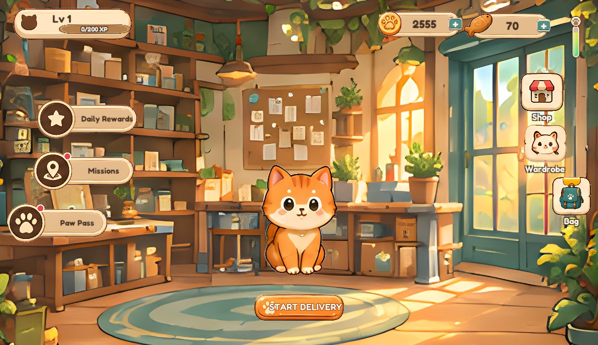


</div>

---

## 🎮 How to play

- **Walk:** paw stick on the left, or WASD / arrow keys
- **Run:** hold RUN or push the stick to the edge, or hold Shift
- **Jump:** JUMP, or Space
- **Look around:** drag the right side, or Q / E
- **Cat View / Top View:** the view button, or V
- **Auto-walk to the target:** tap the quest card

New here? Open **How to Play** on the home screen. It is a little storybook that walks through every rule.

## 📦 The loop

<table>
<tr>
<td width="50%">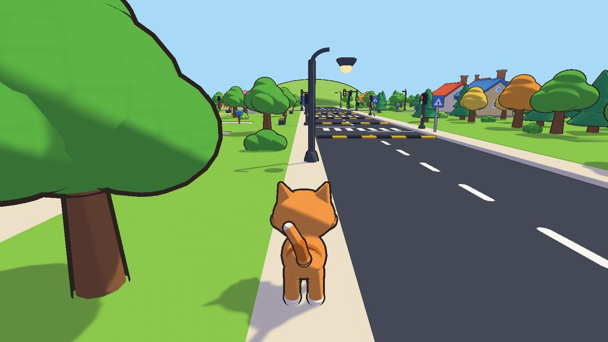</td>
<td width="50%">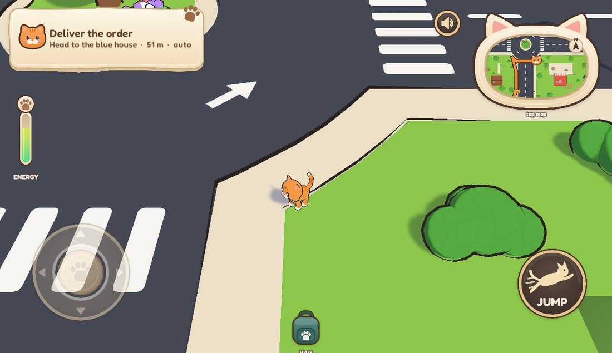</td>
</tr>
<tr>
<td><b>1. Take an order.</b> The job board offers short hops at first, then farther, multi-stop, better paid jobs as you level up.</td>
<td><b>2. Find the way.</b> The arrow follows the sidewalks and the safe crossings; the mini map turns with you.</td>
</tr>
<tr>
<td>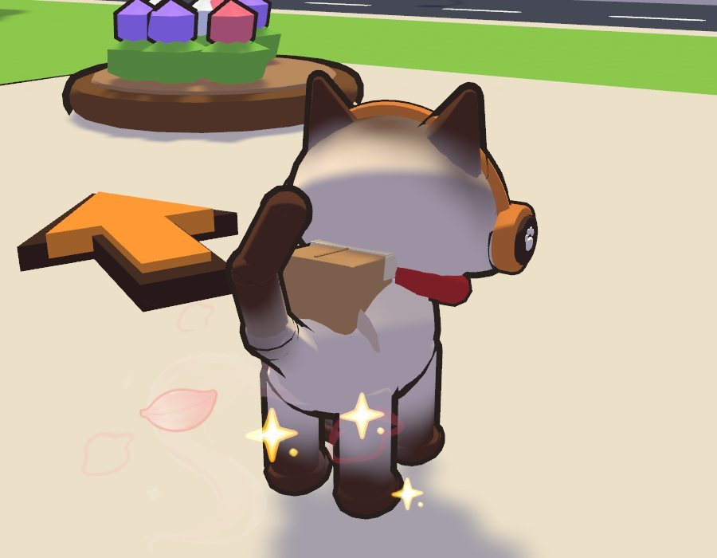</td>
<td>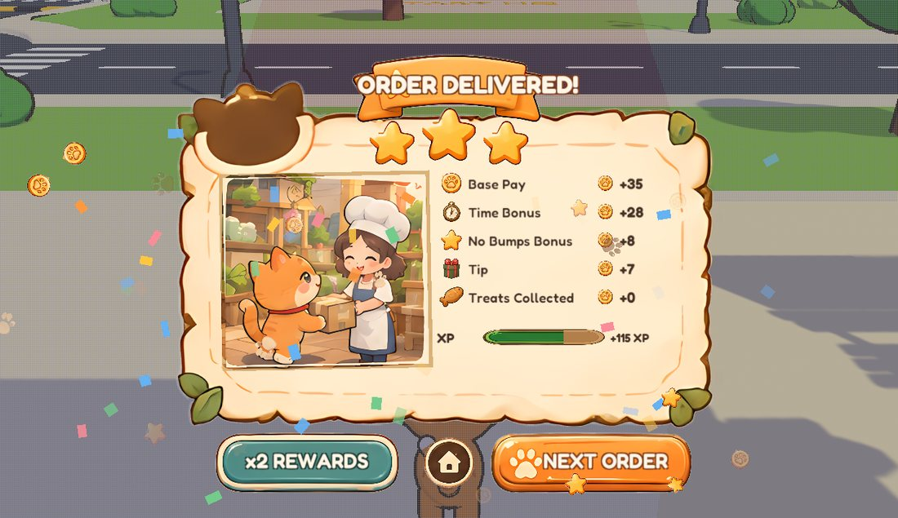</td>
</tr>
<tr>
<td><b>3. Carry it home.</b> Parcels ride on Mochi's back. Roads are dangerous: jaywalking or getting bumped by a car costs a Golden Fish.</td>
<td><b>4. Get paid.</b> Base pay plus time bonus, no-bumps bonus, tip and treats, with up to three stars and XP.</td>
</tr>
</table>

**Energy is the pressure.** Walking drains it slowly; running, swimming and jumping drain it fast; standing still refills it. Treats in your bag top it up, and if it hits zero Mochi is too sleepy to move.

<table>
<tr>
<td width="50%">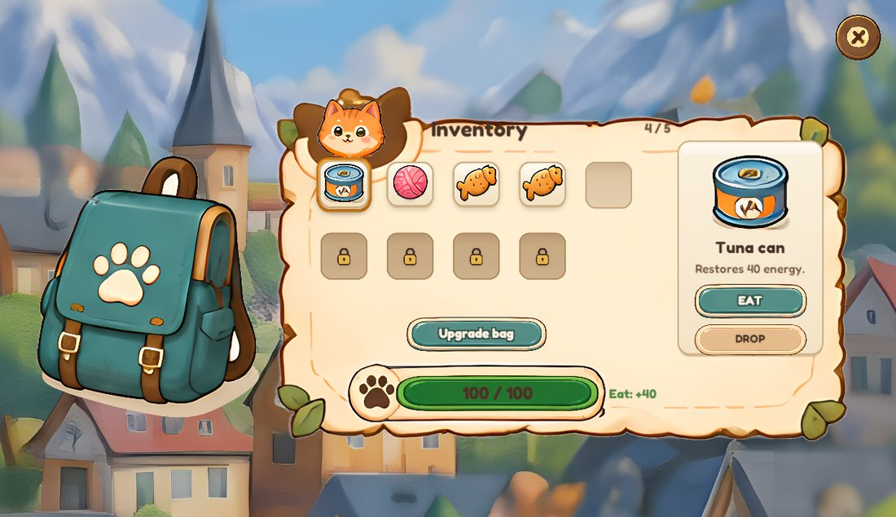</td>
<td width="50%">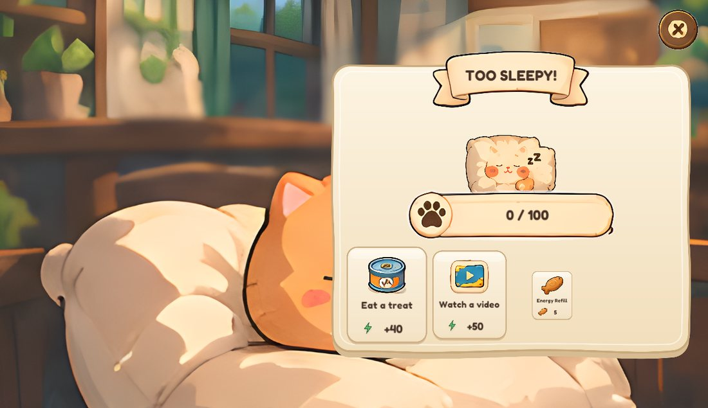</td>
</tr>
</table>

## 🌟 Reasons to come back tomorrow

<table>
<tr>
<td width="50%">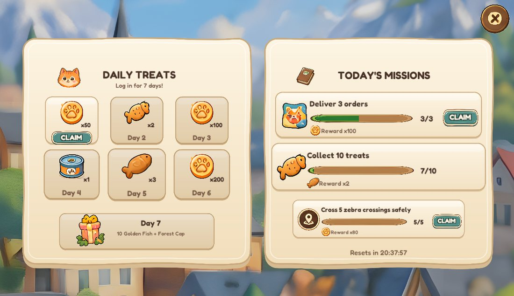</td>
<td width="50%">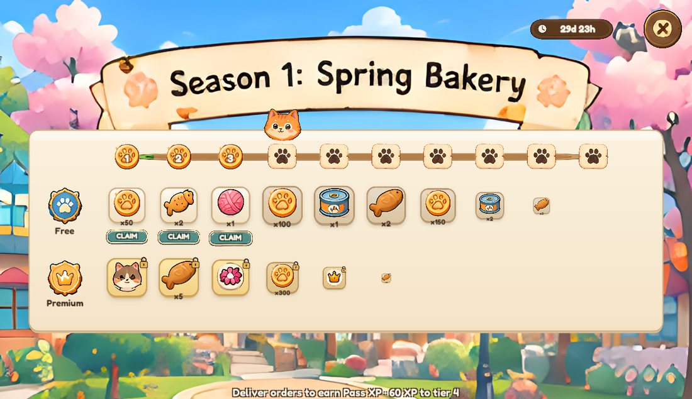</td>
</tr>
<tr>
<td><b>Daily treats and missions.</b> A 7-day login streak (day 7 is a hat and 10 Golden Fish) and three fresh missions every day.</td>
<td><b>Paw Pass.</b> A 30-day season with a free track and a VIP track, filled by delivering.</td>
</tr>
<tr>
<td>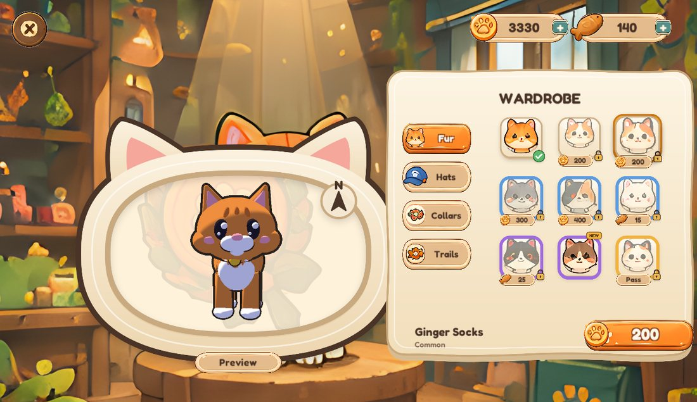</td>
<td>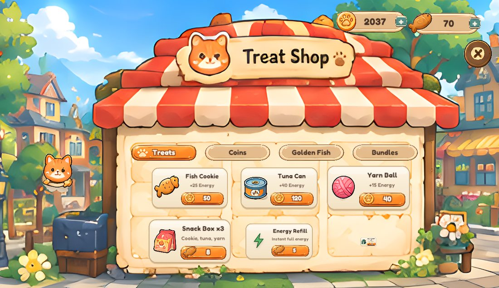</td>
</tr>
<tr>
<td><b>Wardrobe.</b> Furs, fur patterns, hats, faces, collars and magic trails, previewed on a 3D Mochi you can spin.</td>
<td><b>Treat Shop.</b> Treats, a bigger bag, coin packs, Golden Fish packs and bundles.</td>
</tr>
</table>

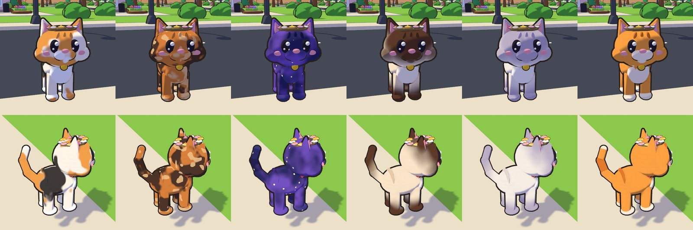

Level-ups pay out too: coins every level, Golden Fish every 3rd level, an extra bag slot every 4th, and orders with more stops.

## 💰 Payments in this build

There is no payment gateway yet. Every real-money item opens a **secret coupon** checkout: a valid code completes the purchase, anything else fails. Rewarded videos are a 3-second stand-in. `PawMenus.Purchase` and `PawMenus.FakeAd` are the two seams where Unity IAP and an ad SDK plug in.

## 🛠️ Under the hood

- **Endless town.** 24 m snap tiles stream in around the cat with traffic, trains, rail crossings, traffic lights and a river.
- **Runtime UI.** Every screen is built in code from sprites in `Resources/Screens`, with 9-slice panels, a safe-area aware canvas fit and a player-editable HUD layout.
- **Toon shader** with procedural fur patterns read from a baked rest pose, so patterns stay put while the cat animates.
- **Web build** via `PawTown > 5. Build Web (WebGL)`: a custom full-window template, crunched DXT textures (158 MB down to 37 MB) and a gzip fallback that works on any static host.

## 📁 Repository layout

```
My project/            Unity 6 project
  Assets/PawTown/
    Scripts/Runtime/   gameplay, economy, menus, HUD
    Scripts/Editor/    prefab + scene builder, web build
    Resources/         UI sprites, cosmetics, trails, parcels, audio
    Shaders/           PawToon
  Assets/WebGLTemplates/CatsTale/
docs/img/              screenshots for this page
```

## ▶️ Building it yourself

1. Open `My project` in Unity **6000.4**.
2. `PawTown > 1. Build Prefabs`, then `PawTown > 2. Create Demo Scene` rebuilds the prefabs and the town from the models in `Assets/PawTown/Models`.
3. Press Play in `Assets/PawTown/Scenes/PawTown_Demo.unity`.
4. `PawTown > 5. Build Web (WebGL)` writes the browser build to `WebBuild/`; `PawTown > 6. Back to Android` switches back.
5. `PawTown > 4. Reset Save (fresh player)` wipes progress to replay the new-player flow.
